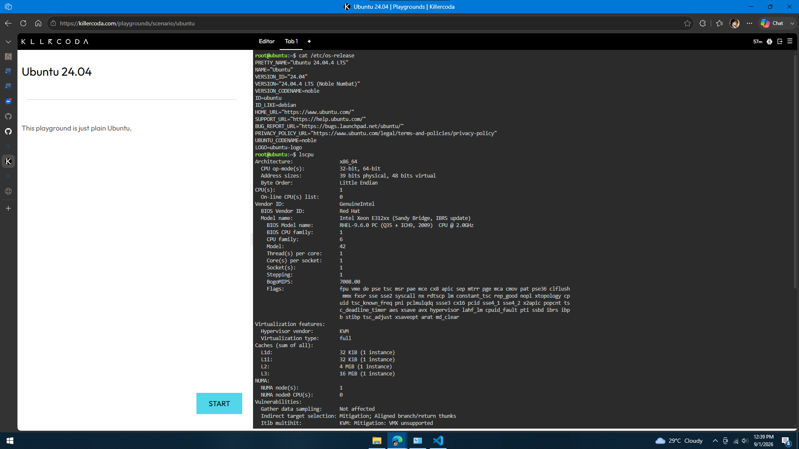

# Linux Investigation

The Linux environment was investigated using a KillerCoda Playground.

## Operating System

### Command Used

```bash
cat /etc/os-release
```

### Result

```text
PRETTY_NAME="Ubuntu 24.04.4 LTS"
NAME="Ubuntu"
VERSION_ID="24.04"
VERSION="24.04.4 LTS (Noble Numbat)"
ID=ubuntu
ID_LIKE=debian
UBUNTU_CODENAME=noble
```

The operating system is Ubuntu 24.04.4 LTS.

## CPU Information

### Command Used

```bash
lscpu
```

### Result

```text
Architecture: x86_64
CPU(s): 1
On-line CPU(s) list: 0
Vendor ID: GenuineIntel
Model name: Intel Xeon E312xx (Sandy Bridge, IBRS update)
BIOS Model name: RHEL-9.6.0 PC (Q35 + ICH9, 2009) CPU @ 2.00GHz
CPU family: 6
Model: 42
Thread(s) per core: 1
Core(s) per socket: 1
Socket(s): 1
```

The environment uses an x86_64 Intel Xeon E312xx processor with 1 CPU, 1 core, and 1 thread.

## Memory

### Command Used

```bash
free -h
```

### Result

```text
              total   used   free   shared   buff/cache   available
Mem:           1.9Gi   410Mi  871Mi  1.1Mi    788Mi        1.5Gi
Swap:          1.0Gi   0B     1.0Gi
```

The environment has 1.9 GiB of total memory and approximately 1.5 GiB available memory.

## Disk Space

### Command Used

```bash
df -h
```

### Result

```text
Filesystem      Size  Used  Avail  Use%  Mounted on
tmpfs           191M  996K  190M   1%    /run
/dev/vda1        19G  5.4G   13G  30%    /
tmpfs           952M   84K  952M   1%    /dev/shm
tmpfs           5.0M    0B  5.0M   0%    /run/lock
/dev/vda16      881M  117M  703M  15%    /boot
/dev/vda15      105M  6.2M   99M   6%    /boot/efi
```

The main filesystem `/dev/vda1` has 19 GB of total storage, with 13 GB available and 30% used.

## Linux Investigation Summary

| Resource | Result |
|---|---|
| Operating System | Ubuntu 24.04.4 LTS |
| Architecture | x86_64 |
| CPU | Intel Xeon E312xx |
| CPU Cores | 1 |
| Threads | 1 |
| CPU Speed | 2.00 GHz |
| Total Memory | 1.9 GiB |
| Available Memory | 1.5 GiB |
| Main Disk | 19 GB |
| Main Disk Available | 13 GB |
| Main Disk Usage | 30% |

## Cloud Services That Could Host This Linux Server

| Cloud Provider | Service |
|---|---|
| AWS | Amazon EC2 |
| Microsoft Azure | Azure Virtual Machines |
| GCP | Compute Engine |

## Evidence

