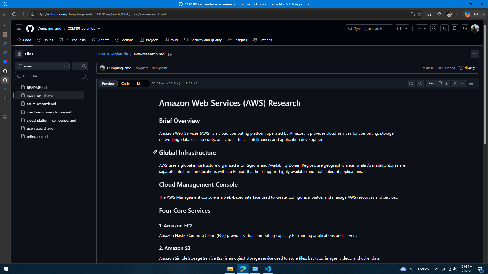

# Amazon Web Services (AWS) Research

## Brief Overview

Amazon Web Services (AWS) is a cloud computing platform operated by Amazon. It provides cloud services for computing, storage, networking, databases, security, analytics, artificial intelligence, and application development.

## Global Infrastructure

AWS uses a global infrastructure organized into Regions and Availability Zones. Regions are geographic areas, while Availability Zones are separate infrastructure locations within a Region that help support highly available and fault-tolerant applications.

## Cloud Management Console

The AWS Management Console is a web-based interface used to create, configure, monitor, and manage AWS resources and services.

## Four Core Services

### 1. Amazon EC2

Amazon Elastic Compute Cloud (EC2) provides virtual computing capacity for running applications and servers.

### 2. Amazon S3

Amazon Simple Storage Service (S3) is an object storage service used to store files, backups, images, videos, and other data.

### 3. Amazon VPC

Amazon Virtual Private Cloud (VPC) provides a logically isolated virtual network for AWS resources.

### 4. AWS IAM

AWS Identity and Access Management (IAM) manages users, roles, permissions, and access to AWS resources.

## Three Advantages

1. AWS provides a broad range of cloud services.
2. AWS has a large global infrastructure.
3. AWS resources can scale according to business requirements.

## Typical Enterprise Use Cases

- Web application hosting
- E-commerce
- Database hosting
- Data storage
- Backup and disaster recovery
- Artificial intelligence
- Containerized applications
- Global applications

## Evidence

## Source

Amazon Web Services official documentation.