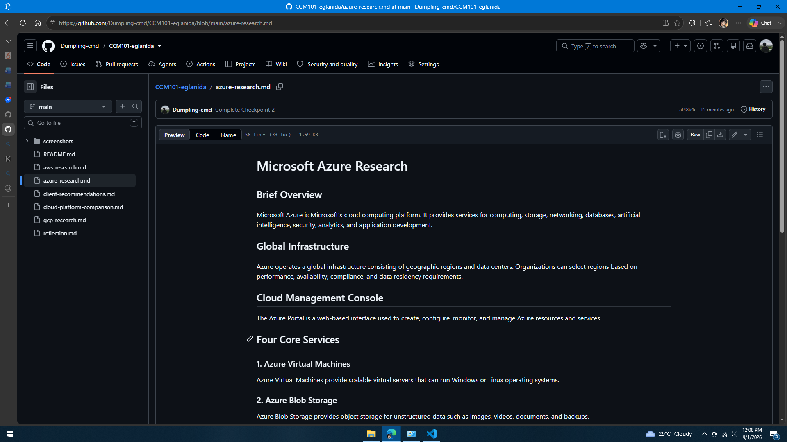

# Microsoft Azure Research

## Brief Overview

Microsoft Azure is Microsoft's cloud computing platform. It provides services for computing, storage, networking, databases, artificial intelligence, security, analytics, and application development.

## Global Infrastructure

Azure operates a global infrastructure consisting of geographic regions and data centers. Organizations can select regions based on performance, availability, compliance, and data residency requirements.

## Cloud Management Console

The Azure Portal is a web-based interface used to create, configure, monitor, and manage Azure resources and services.

## Four Core Services

### 1. Azure Virtual Machines

Azure Virtual Machines provide scalable virtual servers that can run Windows or Linux operating systems.

### 2. Azure Blob Storage

Azure Blob Storage provides object storage for unstructured data such as images, videos, documents, and backups.

### 3. Azure Virtual Network

Azure Virtual Network provides private networking for Azure resources.

### 4. Microsoft Entra ID

Microsoft Entra ID provides identity and access management for users and applications.

## Three Advantages

1. Strong integration with Microsoft technologies.
2. Strong hybrid-cloud capabilities.
3. Large global infrastructure.

## Typical Enterprise Use Cases

- Windows Server migration
- Microsoft 365 environments
- Enterprise applications
- Hybrid cloud
- Database hosting
- Artificial intelligence
- Identity management
- Application development

## Evidence

## Source

Microsoft Azure official documentation.