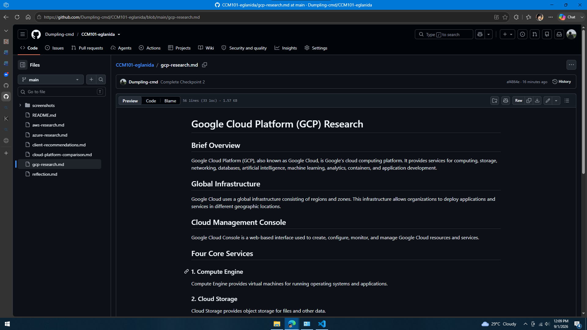

# Google Cloud Platform (GCP) Research

## Brief Overview

Google Cloud Platform (GCP), also known as Google Cloud, is Google's cloud computing platform. It provides services for computing, storage, networking, databases, artificial intelligence, machine learning, analytics, containers, and application development.

## Global Infrastructure

Google Cloud uses a global infrastructure consisting of regions and zones. This infrastructure allows organizations to deploy applications and services in different geographic locations.

## Cloud Management Console

Google Cloud Console is a web-based interface used to create, configure, monitor, and manage Google Cloud resources and services.

## Four Core Services

### 1. Compute Engine

Compute Engine provides virtual machines for running operating systems and applications.

### 2. Cloud Storage

Cloud Storage provides object storage for files and other data.

### 3. Cloud SQL

Cloud SQL is a managed relational database service.

### 4. Google Kubernetes Engine

Google Kubernetes Engine (GKE) is a managed Kubernetes service for containerized applications.

## Three Advantages

1. Strong artificial intelligence and machine learning capabilities.
2. Strong Kubernetes support.
3. Powerful data and analytics services.

## Typical Enterprise Use Cases

- Artificial intelligence
- Machine learning
- Data analytics
- Kubernetes applications
- Web applications
- Database systems
- Research workloads
- Containerized applications

## Evidence

## Source

Google Cloud official documentation.