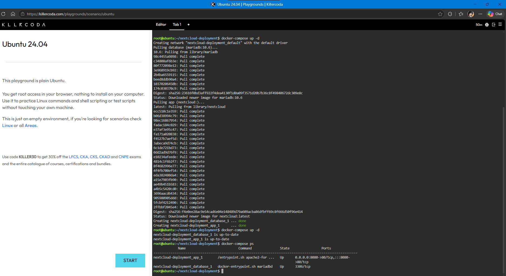
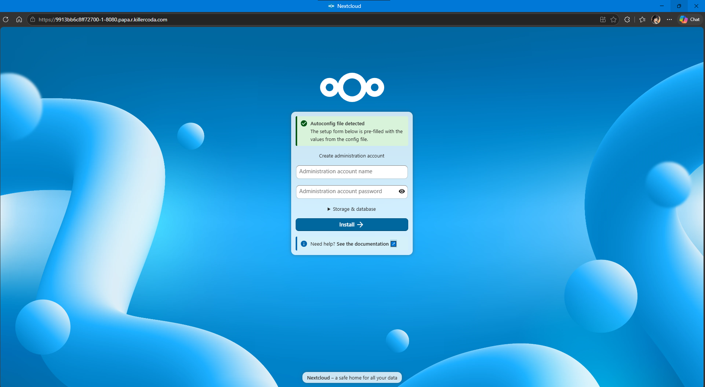
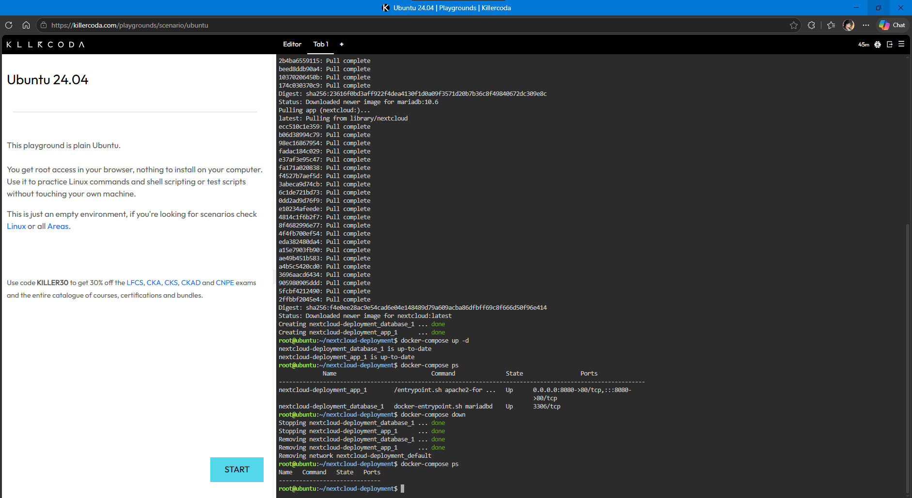

# Laboratory 06 – Cloud Deployment Engineer

**Name:** Edmund Glanida

**Course and Section:** BSIT 4-L

## Mission Overview

This laboratory focused on deploying a multi-tier application using Docker Compose. The application consists of a Nextcloud web/application tier and a MariaDB database tier.

## Objectives

- Understand two-tier architecture.
- Create a Docker Compose YAML configuration.
- Deploy multiple containers using Docker Compose.
- Connect Nextcloud to a MariaDB database.
- Access the application through a browser.
- Tear down the deployment using Docker Compose.

## Files

- [Multi-Tier Architecture](./multi-tier-architecture.md)
- [Docker Compose Guide](./docker-compose-guide.md)
- [Mission Reflection](./reflection.md)

## Screenshots

### Compose Deployment



### Nextcloud Web Setup



### Compose Teardown



## Commands Executed

```bash
mkdir nextcloud-deployment
cd nextcloud-deployment
nano docker-compose.yml
docker-compose up -d
docker-compose ps
docker-compose down